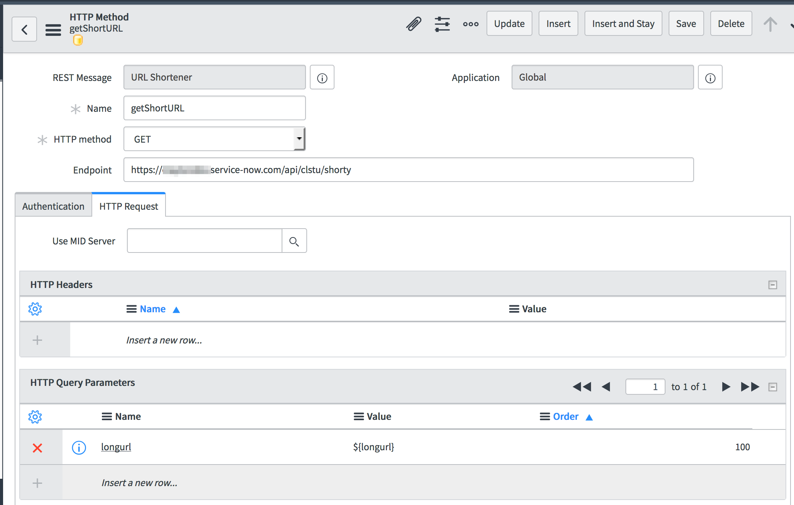

A simple url shortener that doesn't require an external service.

Requires an HTTP Method called getShortURL.

 - endpoint https://<your-instance>.service-now.com/api/clstu/shorty
 - HTTP query parameters
 -- Name:  longurl
 -- Value:  ${longurl}

 